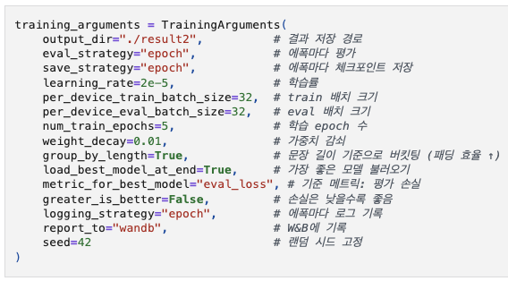
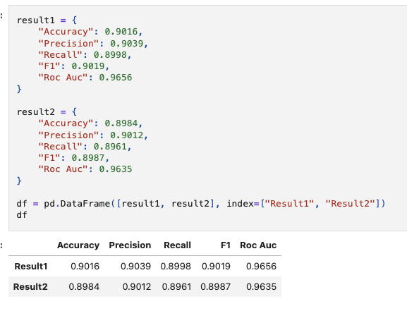
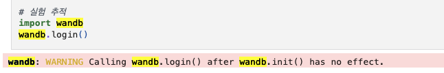
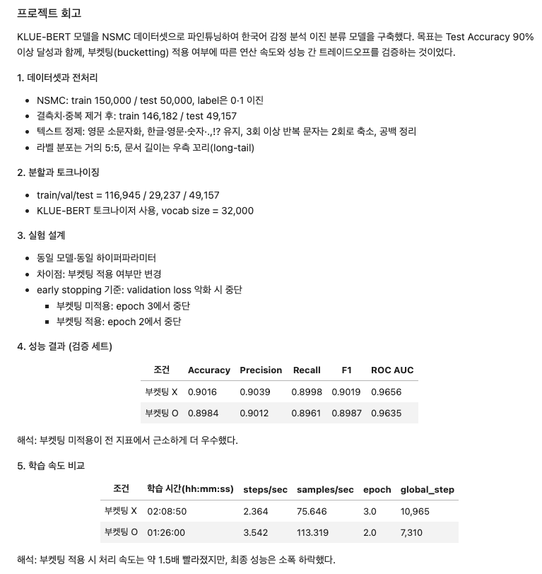
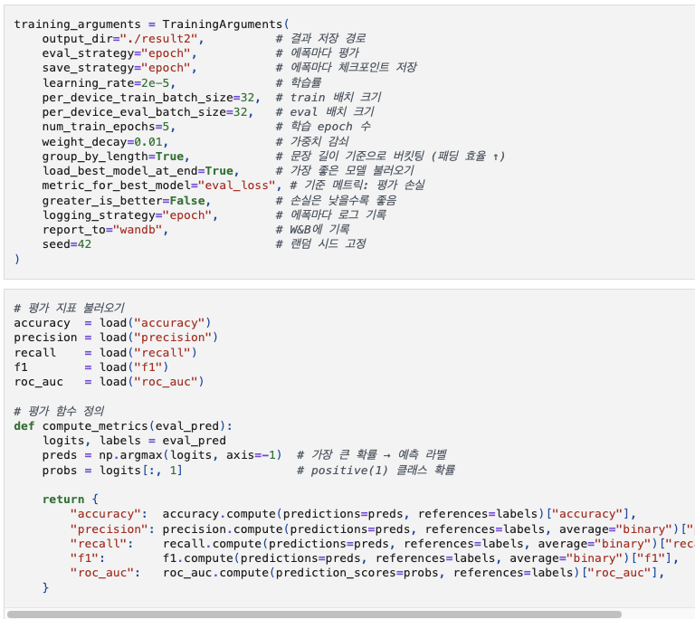

# AIFFEL Campus Online Code Peer Review Templete
- 코더 : 이규철
- 리뷰어 : 박진용


# PRT(Peer Review Template)
- [x]  **1. 주어진 문제를 해결하는 완성된 코드가 제출되었나요?**
  bucketing을 훌륭히 수행했고 이를 기존 tuning과 비교하며 훌륭히 분석해냄  
- 
- 
- [x]  **2. 전체 코드에서 가장 핵심적이거나 가장 복잡하고 이해하기 어려운 부분에 작성된 
주석 또는 doc string을 보고 해당 코드가 잘 이해되었나요?**
- wandb를 통해 좀더 편리한 분석이 가능하다는걸 알려주심 다음 프로젝트에 시간이 된다면 시도해보겠음
- 
    - 해당 코드 블럭을 왜 핵심적이라고 생각하는지 확인
    - 해당 코드 블럭에 doc string/annotation이 달려 있는지 확인
    - 해당 코드의 기능, 존재 이유, 작동 원리 등을 기술했는지 확인
    - 주석을 보고 코드 이해가 잘 되었는지 확인
        - 중요! 잘 작성되었다고 생각되는 부분을 캡쳐해 근거로 첨부
        
- [x]  **3. 에러가 난 부분을 디버깅하여 문제를 해결한 기록을 남겼거나
새로운 시도 또는 추가 실험을 수행해봤나요?**
- 버켓팅 시도 전후의 성능을 비교하며 버켓팅의 강점인 빠른 속도를 잘 캐치하였다.
- 
    - 문제 원인 및 해결 과정을 잘 기록하였는지 확인
    - 프로젝트 평가 기준에 더해 추가적으로 수행한 나만의 시도, 
    실험이 기록되어 있는지 확인
        - 중요! 잘 작성되었다고 생각되는 부분을 캡쳐해 근거로 첨부
        
- [x]  **4. 회고를 잘 작성했나요?**
- 체계적으로 회고를 잘 작성함. 결과 표를 시각화하여 보여줘 가독성을 높힘
- 실험 설정의 근거를 잘 보여주고 해당 근거를 바탕으로 결론을 내림
- 
    - 주어진 문제를 해결하는 완성된 코드 내지 프로젝트 결과물에 대해
    배운점과 아쉬운점, 느낀점 등이 기록되어 있는지 확인
    - 전체 코드 실행 플로우를 그래프로 그려서 이해를 돕고 있는지 확인
        - 중요! 잘 작성되었다고 생각되는 부분을 캡쳐해 근거로 첨부
        
- [x]  **5. 코드가 간결하고 효율적인가요?**
- 코드자체가 깔끔하고 저보다 잘 짜서 훈수둘게 없어요..
- 
    - 파이썬 스타일 가이드 (PEP8) 를 준수하였는지 확인
    - 코드 중복을 최소화하고 범용적으로 사용할 수 있도록 함수화/모듈화했는지 확인
        - 중요! 잘 작성되었다고 생각되는 부분을 캡쳐해 근거로 첨부


# 회고(참고 링크 및 코드 개선)
```
# 리뷰어의 회고를 작성합니다.
같은 데이터를 반복해서 사용하지만 매 프로젝트마나 EDA를 다시 진행하는게 참 인상적입니다
특히 코드 간결화를 정말 잘 하시는것 같습니다. 문제 인식을 정확하게 함으로써 잔가지들을 잘 걷어내시는것 같은데
저도 노력해보겠습니다.
```
